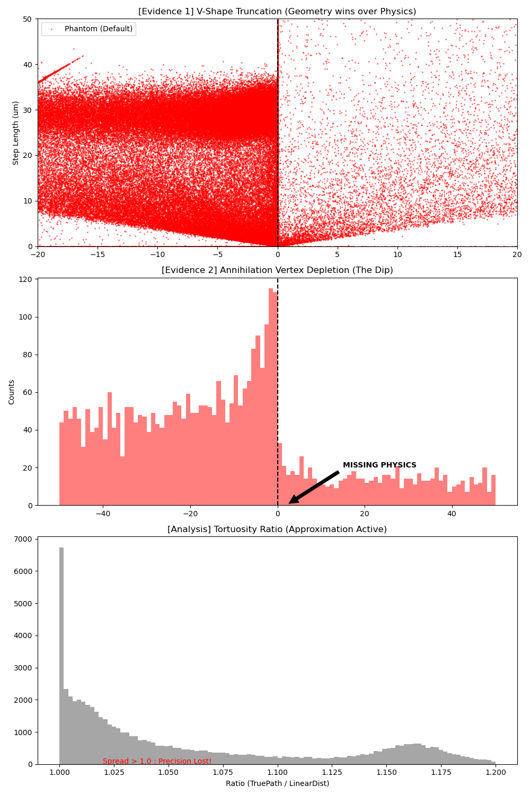
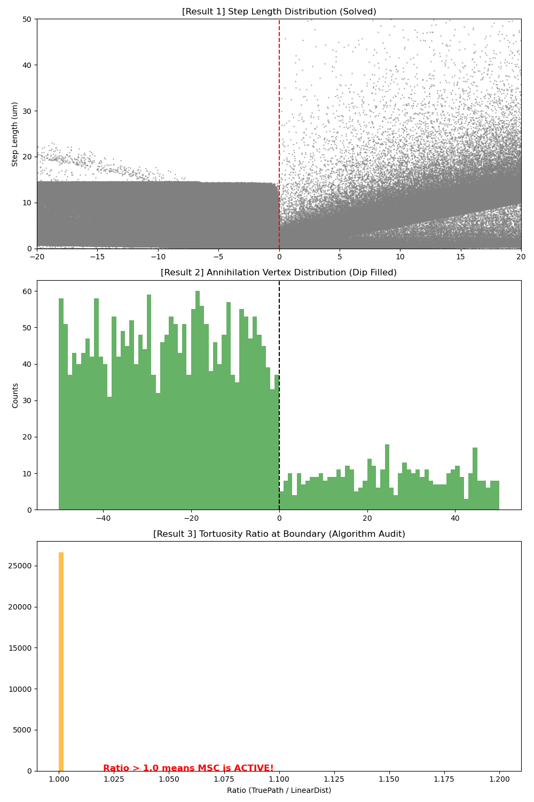

# G4_Boundary_Artifact_Analysis
# Analysis of Boundary Crossing Artifacts in Geant4 Simulations

##  Project Overview
이 프로젝트는 Geant4 몬테카를로 시뮬레이션에서 이질적 매질(Heterogeneous Media) 간의 경계면을 통과할 때 발생하는 입자 수송 알고리즘의 구조적 아티팩트(Artifact)를 분석하고 해결책을 제시합니다.

특히 **고밀도(납, Pb)**와 **저밀도(신틸레이터)** 경계면에서의 **양전자($e^+$) 거동**에 초점을 맞춥니다.

##  Key Findings (현상 분석)

### 1. The Competition: Geometry vs. Physics
입자의 스텝($L_{step}$)이 결정될 때, 물리적 상호작용 거리($L_{phys}$)보다 기하학적 경계 거리($L_{geom}$)가 짧으면 입자는 경계면에 강제로 멈춰섭니다(Truncation). 이는 두 가지 왜곡을 초래합니다.

* **Case A (Default Settings): Artifacts Observed**
    * **V-Shape Truncation:** 경계면 근처 스텝 길이가 기하학적 거리에 종속됨 ($L_{step} \approx L_{geom}$).
    * **The Dip (Vertex Depletion):** 저밀도 매질 초입($0 \sim 3 \mu m$)에서 상호작용(소멸)이 누락됨. 입자가 표면을 '점프'함.
    * **False Pile-up:** 경계면을 넘지 못한 입자들이 고밀도 매질 표면에 강제로 누적되어 과도한 피크 형성.

### 2. The Solution: MSC Tuning
다중 산란(MSC) 파라미터를 조정하여 정밀 추적(Single Scattering)을 강제함으로써 물리적 타당성을 확보했습니다.

* **Case B (Corrected): Physics Restored**
    * **Settings:** `/process/msc/Skin 3`, `/process/msc/RangeFactor 0.02`
    * **Result:** 'Dip'이 사라지고 물리적 상호작용이 복원됨. 고밀도 영역의 과도한 피크가 완화되며 입자가 정상적으로 저밀도 영역으로 이동함(Migration).

##  Results (결과 비교)

| Case A: Default (Artifact) | Case B: Corrected (Solved) |
|:---:|:---:|
|  |  |
| *V-shape 절단 및 소멸 위치 근처에서 밀한 곳에서 과잉, 희박 곳에서 결핍을 동반한 함몰(Dip) 발생* | *물리적 스텝 분포 회복 및 밀한 곳에서 과잉과 희박한 곳에서 결핍이 채워짐* |

##  Usage (사용법)

### Prerequisites
* Geant4 (v11.0+)
* ROOT (Data Analysis)
* Python 3 (Matplotlib, Uproot)

### Build & Run
```bash
mkdir build && cd build
cmake ..
make -j4
./BoundaryTest run.mac
cd analysis
python plot_artifact.py ../build/Boundary_Result.root
```
